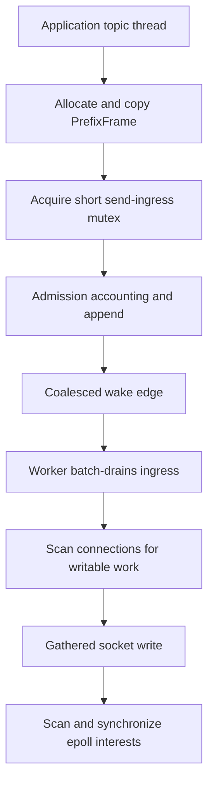
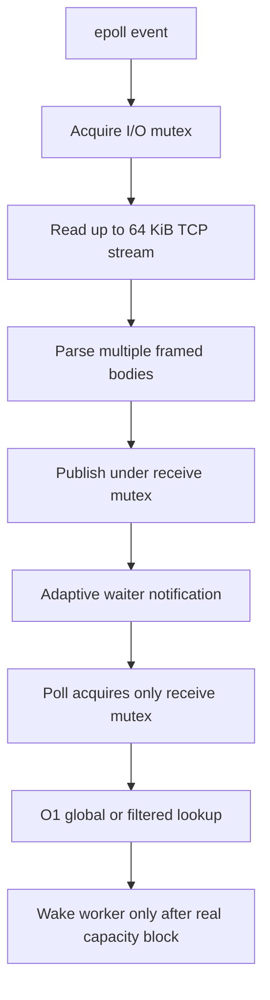

# Mino versus ZeroMQ profiling analysis

This document records the focused performance investigation for
`layer_comparison_benchmark`. The benchmark contract and run instructions are in
[`README.md`](README.md).

## Executive summary

Under the fair L1/L2 benchmark, Mino's single-message path is competitive with
or faster than ZeroMQ. The regression is a concurrency-scaling problem rather
than a basic TCP, WireFrame, or CRC32C problem.

With a 256-byte payload, two TCP lanes, one I/O worker/thread, and 32 concurrent
topics, the original five-run median before the P0 send/wake optimization was:

| Layer | Mino p50 RTT | ZeroMQ p50 RTT | Mino throughput | ZeroMQ throughput | Gap |
|---|---:|---:|---:|---:|---:|
| L1 | 227 us | 71 us | 140.5k msg/s | 418.7k msg/s | ZeroMQ is 2.98x faster by throughput |
| L2 | 254 us | 77 us | 124.4k msg/s | 407.5k msg/s | ZeroMQ is 3.28x faster by throughput |

After adding the P0 send ingress queue and coalesced wake signaling, clean
five-run medians on the same host were:

| Layer | Mino p50 RTT | ZeroMQ p50 RTT | Mino throughput | ZeroMQ throughput | Gap after P0 |
|---|---:|---:|---:|---:|---:|
| L1 | 177 us | 71 us | 177.8k msg/s | 450.8k msg/s | ZeroMQ is 2.54x faster by throughput |
| L2 | 224 us | 78 us | 142.3k msg/s | 399.3k msg/s | ZeroMQ is 2.81x faster by throughput |

After P1 added indexed receive delivery, adaptive waiter notification, bounded
tombstone storage, and shutdown-wait synchronization, five-run medians were:

| Layer | Mino p50 RTT | ZeroMQ p50 RTT | Mino throughput | ZeroMQ throughput | Gap after P1 |
|---|---:|---:|---:|---:|---:|
| L1 | 174 us | 70 us | 181.4k msg/s | 454.9k msg/s | ZeroMQ was 2.51x faster |
| L2 | 223 us | 78 us | 139.5k msg/s | 407.5k msg/s | ZeroMQ was 2.92x faster |

P2 then separated ready-queue polling from the socket/lifecycle mutex, made
receive-capacity wakeups transition-only, and replaced prefix/body-sized reads
with a 64 KiB stream reader that parses multiple frames per syscall. A final
follow-up also sends work captured by the worker's second ingress drain
immediately instead of deferring it through a zero-time readiness turn. The
final interleaved five-run medians are:

| Layer | Mino p50 RTT | ZeroMQ p50 RTT | Mino p95 RTT | ZeroMQ p95 RTT | Mino p99 RTT | ZeroMQ p99 RTT | Mino throughput | ZeroMQ throughput | Mino/ZMQ |
|---|---:|---:|---:|---:|---:|---:|---:|---:|---:|
| L1 | 54 us | 71 us | 67 us | 77 us | 75 us | 94 us | 578.6k msg/s | 449.4k msg/s | 128.7% |
| L2 | 57 us | 78 us | 80 us | 101 us | 98 us | 111 us | 534.8k msg/s | 404.7k msg/s | 132.1% |

Relative to the original Mino baseline, final L1 p50 improved by 76.2% and
throughput by 311.8%; L2 p50 improved by 77.6% and throughput by 329.9%.
Mino now exceeds ZeroMQ in throughput and p50/p95/p99 under the focused fair
workload. A final serial check measured 29 us for both L1 and L2 p50, versus
32 us L1 and 31 us L2 for ZeroMQ.

A separate final three-run scaling sweep with 3,000 messages per topic shows
Mino meeting or exceeding ZeroMQ across the tested range:

| Topics | Mino L1 msg/s | ZMQ L1 msg/s | Mino/ZMQ | Mino L2 msg/s | ZMQ L2 msg/s | Mino/ZMQ |
|---:|---:|---:|---:|---:|---:|---:|
| 1 | 35.7k | 33.5k | 106.6% | 34.2k | 32.4k | 105.6% |
| 2 | 83.2k | 62.0k | 134.2% | 71.0k | 59.7k | 118.9% |
| 4 | 127.2k | 118.5k | 107.3% | 122.9k | 109.6k | 112.1% |
| 8 | 250.7k | 216.7k | 115.7% | 211.0k | 191.6k | 110.1% |
| 16 | 400.5k | 318.8k | 125.6% | 334.0k | 309.4k | 107.9% |
| 32 | 586.4k | 450.5k | 130.2% | 512.6k | 401.8k | 127.6% |

The shared production `WireFrameCodec` and CRC32C workload is no longer the
scaling limiter: final L2 throughput exceeds ZeroMQ across the measured scaling
curve.

## Focused profiling workload

The profiling runs selected one record to avoid mixing setup, serial, and other
topic counts:

- layer: L2
- mode: `per_topic_concurrent`
- topics: 32
- messages per topic: 5,000 for `strace`, 20,000 for `gprof`
- warmup messages per topic: 500 for `strace`
- payload: 256 bytes
- lanes: 2
- outstanding: 1 per topic
- Mino I/O workers: 1
- ZeroMQ `io_threads`: 1

`strace` heavily perturbs timing, so its RTT and elapsed-time values are not
performance results. Only syscall counts and path shape are used below.
`gprof` is also approximate for a multithreaded process; its flat samples and
function-call counts are useful, but its call graph is not treated as a precise
flame graph.

## System-call evidence

### Mino client

| Syscall | Calls | Errors | Share of traced syscall time |
|---|---:|---:|---:|
| `futex` | 1,238,643 | 17,078 | 63.99% |
| `write` | 352,031 | 0 | 9.30% |
| `recvfrom` | 435,318 | 83,292 | 7.98% |
| `sendmsg` | 117,179 | 0 | 7.51% |
| `read` | 255,226 | 127,611 | 6.64% |
| `epoll_wait` | 140,364 | 0 | 4.59% |

The Mino server showed the same shape: about 1.22 million `futex` calls,
352 thousand `write` calls, 439 thousand `recvfrom` calls, and 236 thousand
`read` calls.

After P0, the identical focused Mino client trace became:

| Syscall | Before P0 | After P0 | Reduction |
|---|---:|---:|---:|
| `futex` | 1,238,643 | 659,655 | 46.7% |
| `write` | 352,031 | 59,177 | 83.2% |
| `read` | 255,226 | 118,356 | 53.6% |
| `epoll_wait` | 140,364 | 62,275 | 55.6% |
| `sendmsg` | 117,179 | 103,212 | 11.9% |
| `recvfrom` | 435,318 | 450,651 | -3.5% |

The modestly lower `sendmsg` count is a useful secondary effect: staging ingress
before the worker writes lets the existing gathered-send path combine more
frames.

After P1, the identical focused trace changed again:

| Syscall | Before optimization | After P0 | After P1 | P1 vs P0 | Total reduction |
|---|---:|---:|---:|---:|---:|
| `futex` | 1,238,643 | 659,655 | 597,241 | 9.5% | 51.8% |
| `write` | 352,031 | 59,177 | 52,448 | 11.4% | 85.1% |
| `read` | 255,226 | 118,356 | 104,898 | 11.4% | 58.9% |
| `epoll_wait` | 140,364 | 62,275 | 53,695 | 13.8% | 61.7% |
| `sendmsg` | 117,179 | 103,212 | 94,072 | 8.9% | 19.7% |
| `recvfrom` | 435,318 | 450,651 | 436,129 | 3.2% | -0.2% |

P2's stream-reader trace, collected before the immediate second write pass, shows
the effect of separating the receive lock and buffering the TCP byte stream:

| Syscall | Before optimization | Stream reader P2 | Total reduction |
|---|---:|---:|---:|
| `futex` | 1,238,643 | 547,978 | 55.8% |
| `write` | 352,031 | 8,102 | 97.7% |
| `read` | 255,226 | 16,206 | 93.7% |
| `epoll_wait` | 140,364 | 11,158 | 92.1% |
| `sendmsg` | 117,179 | 13,126 | 88.8% |
| `recvfrom` | 435,318 | 187,035 | 57.0% |

This trace is still instrumentation-perturbed, but its syscall shape matches the
throughput result: sends, wakeups, epoll turns, and TCP receives are batched
rather than occurring near once or multiple times per frame.

### ZeroMQ client

| Syscall | Calls | Errors | Share of traced syscall time |
|---|---:|---:|---:|
| `epoll_wait` | 162,512 | 0 | 54.34% |
| `poll` | 745,304 | 0 | 15.42% |
| `getpid` | 754,321 | 0 | 14.72% |
| `sendto` | 110,565 | 0 | 6.19% |
| `epoll_ctl` | 156,904 | 0 | 3.30% |
| `recvfrom` | 78,900 | 8 | 2.04% |
| `futex` | 1,419 | 319 | 0.02% |

The most important difference is not the readiness API: both implementations
use epoll on Linux. It is synchronization frequency. Mino executes about
1.24 million client-side `futex` calls, versus about 1.4 thousand for ZeroMQ.

Mino's approximately 352 thousand `write` calls are primarily wake-pipe writes.
Both enqueueing a send and consuming received messages call `Wake()`. The worker
then drains the pipe with `read`, creating extra producer/worker hand-offs. The
large number of `recvfrom` calls and `EAGAIN` results also shows that the receive
path repeatedly enters the kernel for the four-byte prefix and body and often
runs until nonblocking exhaustion.

Mino made only seven `epoll_ctl` syscalls in this client trace. Therefore the
millions of `SetEpollInterestLocked()` calls seen in `gprof` are mostly user-space
full scans that hit the unchanged-interest fast path, not millions of kernel
registrations. A dirty-set design should remove this CPU and lock work.

## CPU and call-count evidence

### Mino client flat profile

| Function | Self samples | Calls | Interpretation |
|---|---:|---:|---|
| `DecodeBenchmarkPayload` | 13.54% | 670,870 | Shared benchmark work |
| `EncodeBenchmarkPayload` | 12.50% | 666,933 | Shared benchmark work |
| `WireFrameCodec::Encode` | 8.33% | 664,679 | Shared L2 work |
| `TcpDriver::Impl::SendUntracked` | 8.33% | 662,241 | Mino enqueue, allocation, lock, wake |
| `WireFrameCodec::Decode` | 7.81% | 671,160 | Shared L2 work |
| `ReadConnectionLocked` | 6.25% | 524,262 | Mino receive path under global lock |
| `SetEpollInterestLocked` | 3.13% | 2,707,790 | Repeated interest checks during full scans |
| `DrainUnblockedWritesLocked` | 2.08% | 859,042 | Full connection scan under global lock |
| `PollMessages` | 2.08% | 670,639 | Global queue lookup/removal under lock |
| `WriteConnectionLocked` | 2.08% | 537,049 | Socket writes under global lock |

Additional high call counts:

- `PrepareReceiveReservationLocked`: about 2.39 million
- `connections_.find`: about 1.77 million
- `SyncEpollInterestsLocked`: about 903 thousand
- `ready_messages_.erase`: about 672 thousand
- `PrefixFrame`: about 662 thousand

### Mino server flat profile

The server confirms the same transport costs:

- `WriteConnectionLocked`: 8.64%
- `ReadConnectionLocked`: 8.64%
- `WorkerLoopEpoll`: 6.17%
- `PollMessages`: 4.94%
- `ready_messages_.erase`: 3.70%
- `SendUntracked`: 3.70%
- `SyncEpollInterestsLocked`: about 965 thousand calls
- `SetEpollInterestLocked`: about 4.82 million calls

### ZeroMQ profile shape

The shared payload and WireFrame encode/decode functions also lead the ZeroMQ
profile. Its transport-specific work is distributed through `ypipe`, mailbox,
pipe check/read/write, socket send/receive, and queue batching. It does not show
Mino's million-scale global-lock contention. This is consistent with the
syscall evidence and with the fact that serial Mino performance is already good.

## Hot paths in the current implementation

### Send path

`mino/transport/tcp_driver.cc:274` still constructs a new vector for every
message and copies the complete body behind the four-byte stream prefix.

`mino/transport/tcp_driver.cc:767` and
`mino/transport/tcp_driver.cc:806` now acquire the short-lived
`send_ingress_mutex_`, apply admission/backpressure accounting, and append to a
producer ingress queue. They no longer acquire the driver-wide `mutex_` or
serialize directly with socket reads and writes.

`mino/transport/tcp_driver.cc:1141` uses an atomic pending edge to coalesce wake
pipe writes. The worker allocation-free stages ingress at
`mino/transport/tcp_driver.cc:1165` before processing connection work.



### Worker loop

`mino/transport/tcp_driver.cc:1357` is the epoll worker. On every iteration it
holds `mutex_` while it:

1. batch-drains the send ingress queue;
2. processes closures and timers;
3. scans all connections for receive reservations and heartbeats;
4. scans all connections again in `DrainUnblockedWritesLocked()`;
5. scans listeners and all connections again in `SyncEpollInterestsLocked()`.

After `epoll_wait`, each ready event independently reacquires the I/O/lifecycle
mutex. Socket reads still serialize with worker maintenance, but
`PollMessages()` no longer uses that mutex and cannot block socket progress.

### Receive path

`mino/transport/tcp_driver.cc:2392` reads up to 64 KiB of TCP stream data per
syscall and `mino/transport/tcp_driver.cc:2308` parses as many complete framed
bodies as are available. Large transient receive-buffer capacity is released
after a frame drains, and read-ahead paused for application capacity is excluded
from the network partial-frame timeout.

`mino/transport/tcp_driver.cc:891` owns only `receive_mutex_`, so queue polling no
longer contends with socket I/O, timers, writes, or readiness maintenance. The
indexed global/per-connection FIFO, adaptive waiter notification, bounded
tombstone compaction, and oversized-head semantics remain unchanged.

Receive capacity uses a conservative one-way blocked latch: worker paths only set
it, and a consumer clears it when releasing capacity. A per-connection pause bit
prevents one blocked lane from throttling already-reserved reads on another lane.



## Root-cause ranking and optimization plan

### P0: remove per-message global synchronization — first pass complete

Implemented:

1. `Send()` and `SendUntracked()` use a dedicated admission/ingress lock and no
   longer acquire the driver-wide I/O mutex.
2. The worker stages per-connection ingress with allocation-free `deque::swap()`;
   a second stage after writes preserves FIFO order when an active queue was busy.
3. An atomic wake-pending edge coalesces wake-pipe writes on epoll, kqueue, and
   poll backends.
4. Connection close purges ingress, preserves tracked failure completions, and
   releases admission accounting exactly once.

The syscall and benchmark improvements above validate this direction. The send
admission map is still shared between producers, and socket I/O still uses the
lifecycle/receive mutex; finer per-connection queues can follow if P1 receive
work does not remove enough contention.

### P1: make receive delivery O(1) and less contended — first pass complete

Implemented:

1. Global FIFO deque plus per-connection pointer index for average O(1)
   unfiltered and filtered lookup.
2. Tombstone consumption avoids middle-deque erase; transactional compaction
   keeps physical storage within `max_ready_receive_messages`.
3. Adaptive `notify_one()` for homogeneous unfiltered waiters, with safe
   `notify_all()` fallback when filtered waiters exist and baton passing when
   work remains.
4. Shutdown synchronization closes the previous predicate/notification race.
5. Tests cover interleaved global/filtered ordering, oversized head behavior,
   byte-budget cutoff, bounded tombstone storage, and TSAN concurrency.

The fair benchmark uses unfiltered one-message Poll, so its direct throughput
change is small. Production filtered Poll no longer scans or erases through
unrelated connections, and the focused trace shows lower wake/futex activity.

### P1: replace full worker scans with dirty worklists

Track connections whose send queue, receive capacity, timer deadline, or event
interest changed. Update only those connections rather than scanning all
connections on every worker iteration. Use a deadline structure for timers
instead of recalculating every connection each pass.

Expected impact: removes the approximately 0.9-1.0 million
`SyncEpollInterestsLocked()` calls and multi-million interest/reservation checks.
This matters even though most checks do not result in `epoll_ctl`.

### P2: split receive ownership and buffer stream I/O — complete

Implemented:

1. Dedicated `receive_mutex_`; Poll no longer acquires the socket/lifecycle lock.
2. Transition-only receive-capacity wakeups with a conservative blocked latch.
3. Per-connection 64 KiB chunked TCP stream reader and multi-frame userspace
   parser, replacing separate prefix/body receive syscalls.
4. Capacity-paused read-ahead does not expire as a network partial frame.
5. Large transient receive-buffer capacity is released after drain.
6. Epoll, kqueue, and poll maintenance all resume buffered frames after capacity
   is released.
7. Epoll and kqueue immediately execute a bounded second write pass when the
   post-write ingress drain captures newly queued echoes, avoiding an otherwise
   mandatory zero-time readiness turn before those messages reach the socket.

This stage closed the throughput and tail-latency gaps. Potential future work is
focused on removing the remaining body copy and replacing worker full scans for
very large connection counts rather than the two-lane benchmark.

### P3: preserve already-effective codec work

Hardware CRC32C and `EncodedSize()` are already effective enough that WireFrame
is not the primary bottleneck. Further codec micro-optimization should follow,
not precede, the queue/lock/wake changes.

## Validation criteria for the next optimization

Use the same benchmark contract and compare five-run medians. A change should:

- preserve serial L1/L2 latency;
- improve the slope from 4 to 32 concurrent topics, not only one selected point;
- substantially reduce `futex`, wake-pipe `write`, and wake-pipe `read` counts;
- reduce `SyncEpollInterestsLocked`, `SetEpollInterestLocked`, and filtered ready
  queue operations per delivered message;
- keep all transport, bridge, and phase-barrier tests passing;
- preserve queue limits, shutdown behavior, heartbeat behavior, and backpressure.

## True flame graph status

A Linux `perf` recording could not be collected on the profiling host because
`/proc/sys/kernel/perf_event_paranoid` is `4`; the process lacks `CAP_PERFMON`.
Both `perf stat` and `perf record` are blocked by that policy. No synthetic SVG
is presented as a real flame graph.

With permission to profile, lower the policy temporarily or grant
`CAP_PERFMON`, then record the focused benchmark client and server separately:

```sh
sudo sysctl kernel.perf_event_paranoid=1
perf record -F 999 -g --call-graph dwarf -o mino-client.data -- \
  bazel-bin/benchmarks/transport/layer_comparison_benchmark \
  --backend=mino --layer=l2 --role=client --address=127.0.0.1 \
  --port=19090 --lane-count=2 --mode=per_topic_concurrent \
  --topic-count=32 --messages-per-topic=20000 \
  --warmup-messages-per-topic=500 --output=/tmp/mino-client.json
```

Generate folded stacks and an SVG with the FlameGraph scripts after recording.
The server must already be running with matching flags. On macOS, use Instruments
or `xcrun xctrace` with the Time Profiler template; the production readiness path
there is kqueue rather than epoll, but the shared mutex, wake pipe, queue scans,
and framing copy remain the same architectural hot paths.
