# Mino 滚动升级（D6-16）

本文定义 Shared Memory Region 的 New Region + Drain/Cutover 运维流程。Mino **不原位升级 Region ABI**；升级控制面位于 `//mino/upgrade`，不会向 SuperBlock、Channel、Slot、Allocator 或其他 SHM 布局增加字段。

## 1. 安全与一致性原则

1. source/target 必须是不同 `region_id`、不同 128-bit Region UUID；manifest 同时绑定名称、ID、UUID、layout version 和 Security Domain。
2. source/target 必须属于同一非零 Security Domain。Region attach 仍执行 Region v6 的 immutable CRC、UID/GID/mode 和 Security Domain 校验。
3. 每个 Topic 绑定 source/target Topic ID、config/region/channel/ACL version、完整 Schema Identity（short ID、canonical digest、schema/layout version）和完整 ACL。
4. target ACL 必须与 source ACL 的显式 grant **完全相同**，且 `acl_version` 不得回退。没有 wildcard、没有“同域默认授权”，证据缺失即拒绝，保持 D6-11 fail-closed 语义。
5. cutover 前必须证明 target Region/process/channel/route ready、Schema 双向兼容、ACL 保持和容量 admission/headroom 足够。
6. drain 不是等待一段时间。必须同时证明旧 publisher 已 fenced，publisher/subscriber/pin/outstanding receipt/outstanding borrow/queue depth 全部为零，并满足 `last_consumed_sequence >= last_published_sequence`。
7. cutover 使用 manifest 中不可变的 commit token。部署适配器对同一 token 的 `Prepare/BeginDrain/Cutover/Commit/Rollback` 必须幂等；不同 token 不得接管已激活切换。
8. observe 期间只允许新 Region publisher；旧 publisher 数必须为零，新 publisher 数必须非零，观测样本达到下限，duplicate 和 unexplained loss 必须均为零。

## 2. 状态机

```mermaid
stateDiagram-v2
    [*] --> Prepare
    Prepare --> Validate: target prepared
    Validate --> Drain: readiness + security + schema + capacity valid; fence old publishers
    Drain --> Cutover: complete conservation proof
    Cutover --> Observe: token-idempotent route switch
    Observe --> Commit: target-only publish; no duplicate/loss
    Prepare --> Rollback
    Validate --> Rollback
    Drain --> Rollback
    Cutover --> Rollback: explicit safety proof only
    Observe --> Rollback: explicit safety proof only
    Prepare --> Fail
    Validate --> Fail
    Drain --> Fail
    Cutover --> Fail
    Observe --> Fail
    Commit --> [*]
    Rollback --> [*]
    Fail --> [*]
```



`Cutover` 是**已持久化的 cutover intent**。编排器先把完整 drain proof 写入 journal 并进入 `cutover`，然后调用部署切换。进程若在部署切换后、journal 进入 `observe` 前崩溃，`resume` 会以同一 commit token 重放幂等 `Cutover()`，不会双切或创建第二 publisher。

## 3. Manifest 与 journal

`UpgradeManifestStore` 使用单个有界二进制快照承载 immutable plan 和 phase journal：

- magic + format version；
- generation、创建/更新时间、当前 phase；
- source/target Region identity；
- Topic config/ACL/Schema binding；
- capacity requirement、minimum observation samples；
- commit token；
- 单调 journal entry（sequence、phase、timestamp、detail）；
- CRC32C。

每次推进执行：

1. 编码并校验有界快照；
2. 写 owner-only 临时文件；
3. `fdatasync`（macOS 使用 `fsync`）；
4. 同目录原子 `rename`；
5. `fsync` 父目录。

manifest 旁的 `.lock` 使用 non-blocking `flock`，防止两个 operator 同时推进。实现测试覆盖 temporary write、data sync、rename、parent-directory sync 四个 cutpoint：rename 前恢复旧 generation，rename 后恢复新 generation。CRC、格式、非法 phase 链、Topic/ACL 越界或文件权限异常均 fail-closed。

## 4. 部署控制面契约

`mino::upgrade::ProductionUpgradeControlPlane` 是由 production composition root 绑定 Registry、进程 supervisor、Bus/deployment、真实 Region supervisor 和容量控制器的窄接口。它不进入数据热路径，也不修改 SHM ABI：

- `Prepare`：创建独立 target Region/Channel，并启动新版本进程；READY 前不得发布。
- `ObserveTarget`：从 Region v6 identity、Registry immutable Topic snapshot、Schema compatibility checker 和 Capacity snapshot 生成 readiness proof。
- `BeginDrain`：使 source Topic 拒绝新 publisher，并停止/关闭现有旧 publisher；Bridge 远端重发布也必须停止。
- `ObserveDrain`：汇总 Registry participant/pin、DeliveryReceipt、Borrow/Pin 和 Channel queue/cursor 证据。
- `Cutover`：以 commit token 原子切换 route/alias/config generation；旧 publisher 保持 fenced，新 publisher 只绑定 target Region generation。
- `ObserveCutover`：验证 active Region/token 和消息守恒。
- `Commit`：重新读取真实 reader/borrow/receipt/pin/queue 状态，调用 Coordinator 的批量 retire/delete 门禁，随后由持有 source writable supervisor 的 adapter 执行 Region clean shutdown。
- `Rollback`：cutover 前恢复 source；cutover 后仅在下面的安全条件成立时允许。

`RegionRoutingCatalog` 是新 endpoint 的 durable route truth。文件包含 CRC32C、generation、active Region、source fence 和 commit token；更新使用 generation/CAS、owner lock、data sync、atomic rename 和 parent-directory fsync。LocalBus/TransportSwitcher 在新建 endpoint 或 refresh 时重新读取该 catalog。恢复时 journal 决定应执行的 phase，catalog/Coordinator 当前 generation 和 state 决定相应 side effect 已发生还是需要以同 token 重放。

无法由 Coordinator 直接提供的 Channel cursor、queue、Borrow、receipt 和 sequence/dedup 状态，只能通过 `ProductionUpgradeProbe` 的 typed numeric snapshot 获取；runtime/deployment adapter 必须在 composition root 中绑定真实 LocalBus、BroadcastChannel、Region supervisor 和 TransportSwitcher。CLI 不构造该接口，也没有接受手工布尔值的 apply adapter。

## 5. 回滚规则

| 当前 phase | 允许行为 |
|---|---|
| `prepare/validate/drain` | 可回滚；target 尚未成为发布入口 |
| `cutover/observe` | 默认 forward fix；仅显式 safe rollback proof 可回滚 |
| `commit/rollback/fail` | terminal，不允许再次回滚 |

post-cutover safe rollback proof 必须证明：

- target publisher 已 fenced；
- source 完整 ready，可安全恢复；
- target 在 cutover 后没有 publication；**或**所有 target publication 已完成 sequence + receipt reconciliation，恢复 source 不会重复或产生不可解释 gap。

仅设置超时、只观察 queue depth、只停止 route、或“subscriber 看起来空闲”都不构成安全 proof。

## 6. CLI

```text
mino upgrade plan --manifest <file> --plan <file> [--apply]
mino upgrade status --manifest <file>
mino upgrade inspect --evidence <file>
mino upgrade execute --manifest <file> [--apply --supervisor-socket <path>]
mino upgrade resume --manifest <file> [--apply --supervisor-socket <path>]
mino upgrade rollback --manifest <file> [--apply --supervisor-socket <path>]
```

- `plan/execute/resume/rollback` 默认 dry-run；只有显式 `--apply` 才可能写 manifest。
- `execute/resume/rollback --apply` 只能连接 owner-only production supervisor Unix socket；CLI 不在本地打开 manifest 推进，supervisor 进程持有真实 control plane 并负责推进。
- `--apply --evidence` 永远拒绝；`inspect --evidence` 与 dry-run 只解析、展示离线证据，不产生 side effect。
- `status` 只读取 CRC-validated durable state。
- manifest 更新结果不确定时对象会 poisoned；关闭后重新 `status/resume`，不得在同一对象上猜测重试。

### 6.1 Plan 文件

文件为严格的 `key=value`，必须由当前 UID 拥有、单 hard-link、不可 group/world writable。数字为十进制。

```text
operation_id=prod-edge-20260811
commit_token=至少16字节且全局唯一的随机token
source_region=/mino-old,101,1001,1002,5,77
target_region=/mino-new,202,2001,2002,6,77
required_shm_bytes=536870912
required_publisher_slots=8
required_subscriber_slots=64
minimum_observation_samples=10000

topic=1,2,source/name,target/name,source_config,target_config,source_region_version,target_region_version,source_channel_version,target_channel_version,source_acl_version,target_acl_version,source_schema_short,source_schema_version,source_layout_version,target_schema_short,target_schema_version,target_layout_version,source_digest_hex,target_digest_hex
topic_acl=0,91,77,31
```

`topic` 可重复。`topic_acl` 的第一个值是从 0 开始的 topic index，后续为 Node ID、Security Domain ID、permission bitmask；同一 grant 同时绑定 source 和 target，防止升级时扩大或削弱 ACL。digest 必须是 64 个十六进制字符。

### 6.2 离线 Evidence 文件（仅 inspect/dry-run）

Evidence 可用于历史审计或演练检查，但即使所有布尔字段都是 `true` 也不能推进 manifest。`mino upgrade inspect --evidence <file>` 可解析以下字段：

- `commit_token`、完整 `target_region`；
- 每个 Topic 的实际 `target_topic=id,name,config_version,region_version,channel_version,acl_version,schema_short,schema_version,layout_version,digest`，顺序与 plan 相同；
- `prepared_ack`、`target_topics_ready`；
- Region/process/channel/route readiness；
- `schema_bidirectionally_compatible`、`acl_exactly_preserved`；
- capacity admission 与 available headroom；
- `drain_ack` 和 publisher/subscriber/pin/receipt/borrow/queue/sequence 数值；
- `cutover_ack`、旧/新 publisher 数、样本数、duplicate/loss；
- `commit_ack`；
- rollback ack 与 target fence/source readiness/reconciliation proof。

完整字段模板见 `tools/deployment/rolling_upgrade_drill.sh`。

## 7. 标准操作流程

1. 对 source 记录 Region v6 的 ID/UUID/layout/domain，以及 Registry Topic snapshot 的 config/resource/ACL/Schema versions。
2. 生成随机 commit token 和 plan；权限设为 `0600`。
3. 运行不带 `--apply` 的 `mino upgrade plan`，审阅 source/target、ACL 和容量。
4. `plan --apply` 创建 durable manifest；备份 manifest 只用于审计，不得复制后双写推进。
5. 部署 target，在 production composition root 中绑定真实 Region/Coordinator/LocalBus probe 和 supervisor control socket；运行 `execute --apply --supervisor-socket <path>`。proof 不完整返回 `WouldBlock/Unavailable` 时修复真实对象状态，不以 sleep 或手工布尔值代替。
6. 若进程崩溃，运行 `status` 后使用同一 production supervisor socket 执行 `resume --apply --supervisor-socket <path>`；journal + catalog + Coordinator state 会判定 side effect 是否已经发生。
7. `observe` 出现 duplicate 或 unexplained loss 时进入 degraded，保持 source retired/fenced 状态并优先 forward fix；不要无证明回切。
8. `commit` 后按 Registry Topic lifecycle 释放 participant/pin，再 retire/detach source Region。历史 Schema/recording metadata 保留。

## 8. 演练与验证

本地演练：

```bash
bazel test //tools/deployment:rolling_upgrade_drill_test --test_output=streamed
```

脚本验证：

- dry-run 不创建 manifest；
- 离线 evidence 即使全为 `true` 也只能 inspect/dry-run；
- 缺少 production supervisor socket 时 apply fail-closed；
- manifest 保持在 `prepare`，不会被离线文件推进。

完整 `prepare → validate → drain → cutover → observe → commit`、真实 Coordinator/双 Region/LocalBus 消息守恒以及 durable cutover 后的恢复由 `//mino/upgrade:rolling_upgrade_integration_test` 覆盖。

代码级测试：

```bash
bazel test //mino/upgrade:upgrade_test \
  //mino/upgrade:rolling_upgrade_integration_test --test_output=errors
```

集成测试使用真实 Coordinator、两个 SharedMemoryRegion、LocalBus/BroadcastChannel publisher/subscriber。source 与 target 分别发布一段连续 payload 序列，并在“durable catalog Cutover side effect 已发生、observe journal 尚未持久化”处注入崩溃；恢复后根据 journal + catalog 重放同 token，最终断言所有 payload 恰好一次、无不可解释丢失，并验证 source Topic 已通过 retire/delete 门禁且 Region 为 clean CLOSED。
